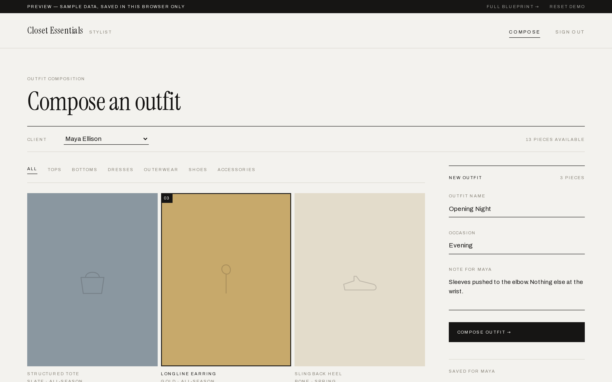
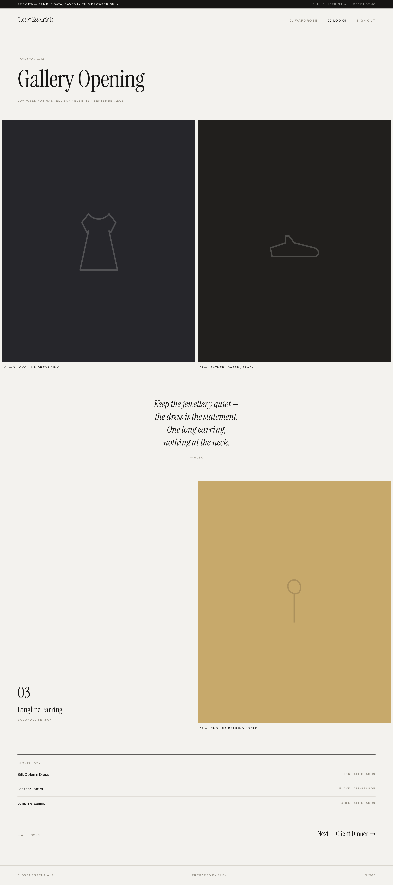
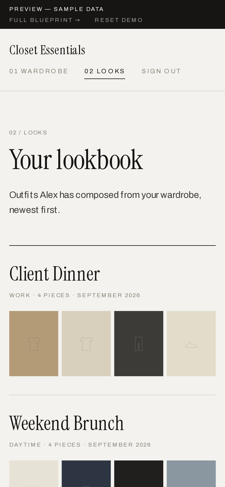
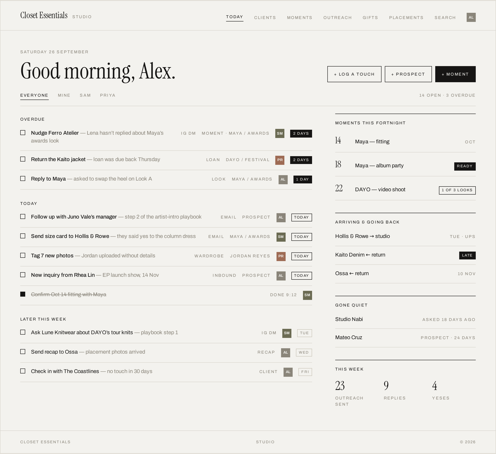
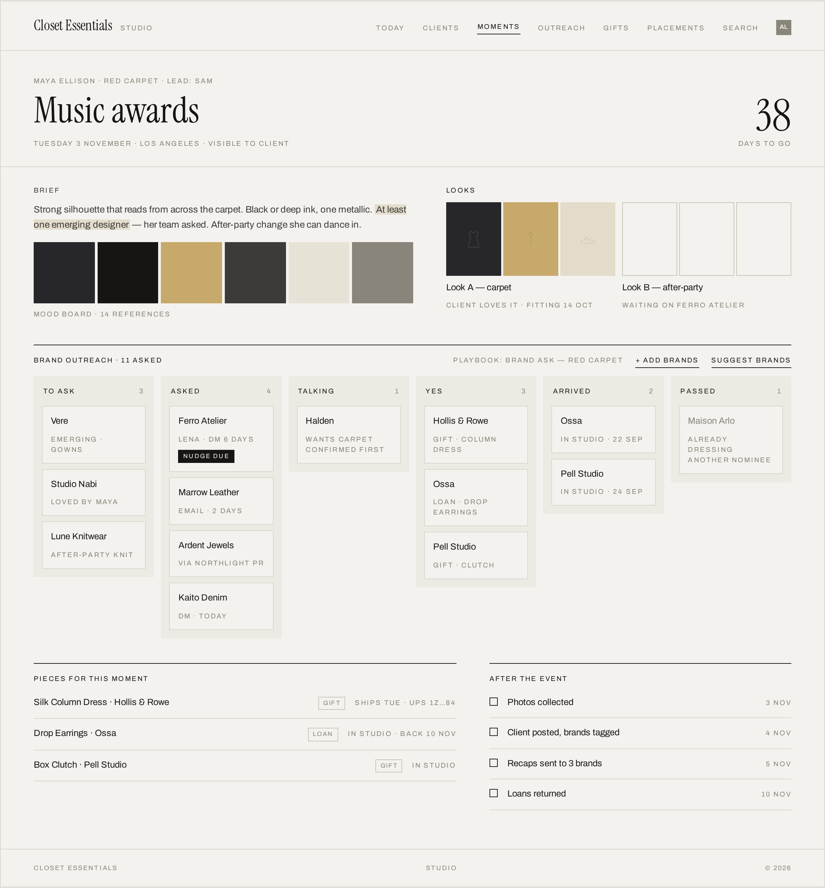
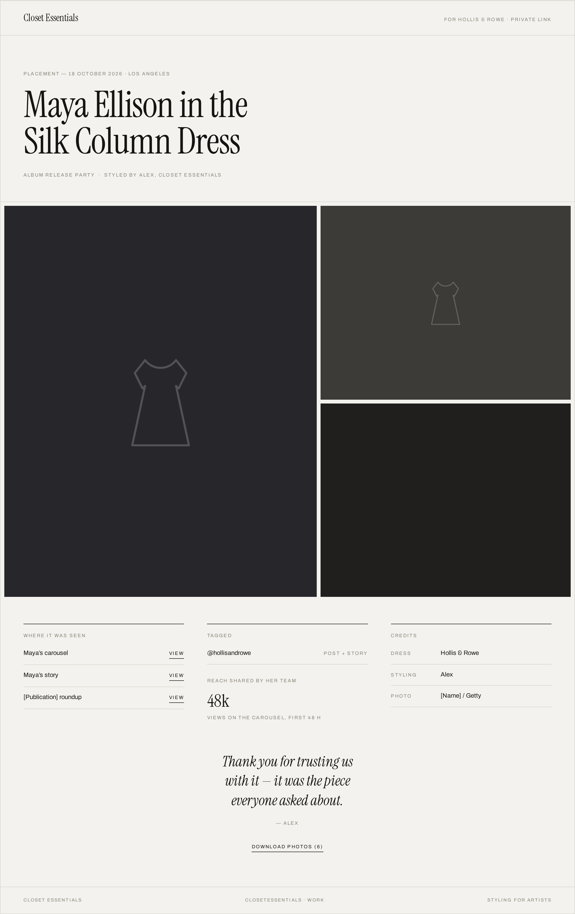



## The brief

A working stylist runs her business out of a shared notes app and hundreds of Instagram DMs: client wardrobes, outfit planning, brand requests, loans to return, follow-ups to remember. She started with a narrow ask, a way to collect clients' wardrobes, and a rough proof-of-concept. I took it from there to something she can put in front of clients.

## What I built

**A private portal for every client.** Clients photograph their pieces from their phone, and the wardrobe fills in as a gallery grid. Photos are resized in the browser before upload, so the grid stays fast. When the stylist composes an outfit, the client gets it back as an editorial lookbook page: the pieces in order, full-size, with a note on how to wear it.

**A composer for the stylist.** Pick a client, tap pieces in the order they should appear, name the look, add a note, and preview it exactly as the client will see it.

**A visual identity that fits her world.** Gallery-white and editorial, modeled on high-end stylist portfolios rather than generic software. There is no accent color, so the clothes carry all of it.



::: {.project-shots}

{.shot-phone}
:::

## What I fixed

The original prototype's admin tools were open to anyone who found the URL, including every client's email address. I moved the stylist check onto the server and put it in front of every admin route, wrote row-level security so each client can only ever read and write their own data and their own photo folder, and upgraded the framework past a published security advisory.

It now ships through a proper pipeline: every change is build-checked on GitHub and deployed automatically, and a demo mode lets anyone use the full app on sample data with no account or backend.

## Where it's going

The next phase turns the tool into a studio for the whole practice. I mapped it as a 30-screen product blueprint: spotting rising artists and tracking outreach, running brand requests in structured follow-up sequences, tracking gifted and loaned pieces, and sending brands a polished recap of every placement. The aim is for it to feel like her notes app got smarter, not like enterprise software.

::: {.project-shots}

:::
