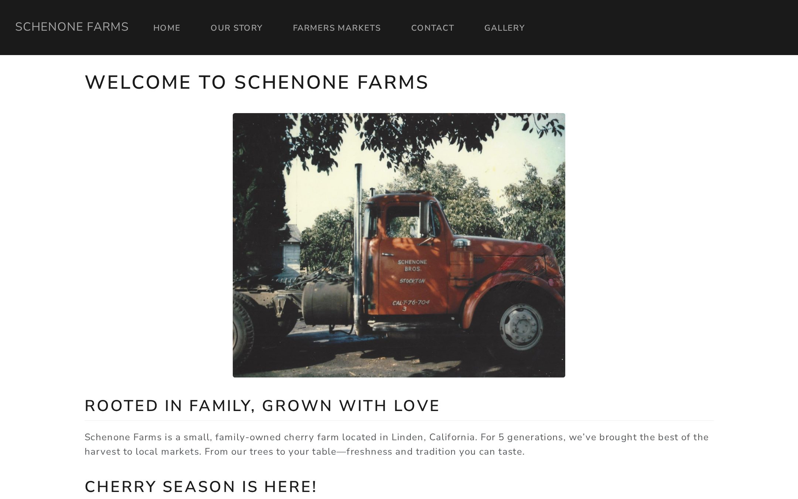
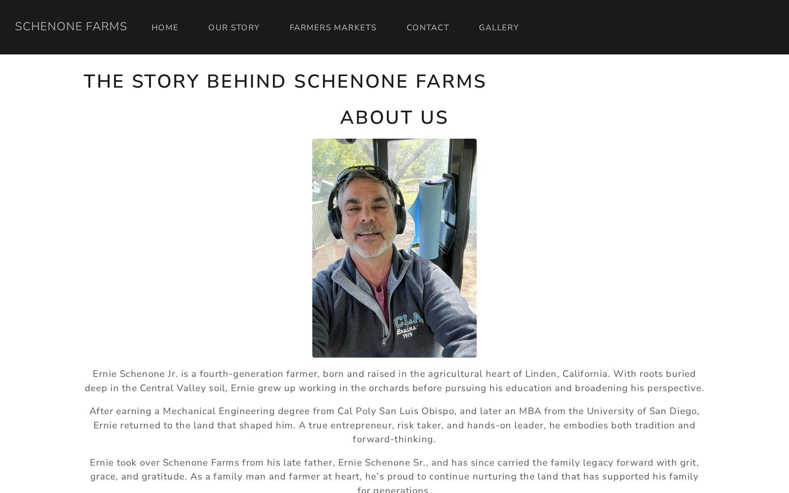
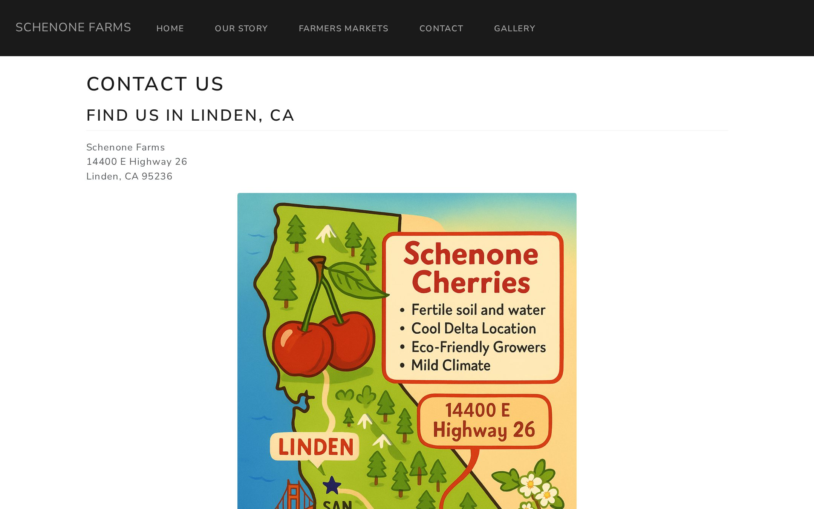
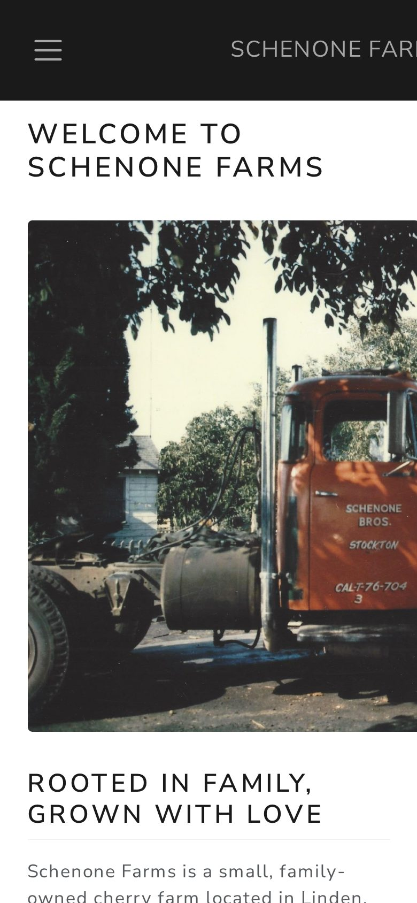



## The brief

Schenone Farms is a small, family-owned cherry farm in Linden, California, run by the family for five generations. Each season it sells fresh-picked cherries direct to customers, including weekends at Kobey's Swap Meet in San Diego from May through early July. What it was missing was one place to point people to: who the family is, where to find them this weekend, and how to order.

## What I built

A five-page site with the farm's own voice and photos at the center:

- **Home**: the farm in one line and this season's market schedule, so the most time-sensitive thing is the first thing people see.
- **Our Story**: the family history, from Ernie Schenone Sr. to today, told alongside photos from the orchard and the family archive.
- **Contact**: the farm's address and map, weekend market hours, an email for private and wholesale orders, and Instagram.
- **Gallery**: harvest photos from the season, from blossoms to the full bins.

It launched on the farm's own domain, schenonefarms.com, on free static hosting, so there was nothing to maintain and nothing to pay for beyond the domain.

::: {.project-shots}

{.shot-phone}
:::

## What I'd do next

The site was built as a seasonal storefront. If it comes back, the next step is making it work year-round: a market schedule the family can update from their phone, a simple pre-order form for pickup at the market, and walnut sales in the off-season.
